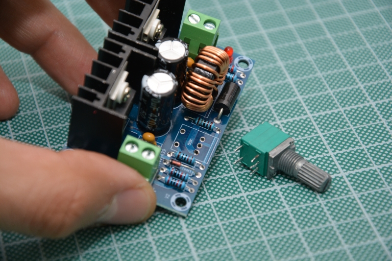
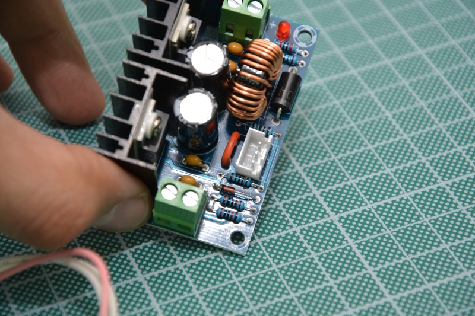
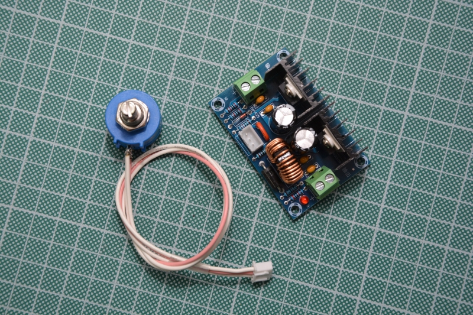

# Supplino

Supplino is a _Quick & Dirty_ PSU (_Power Supply Unit_) made with some widely available breakout boards, an Arduino Nano (or an Arduino Nano Every) and a graphical LCD.

  

Supplino is the circuit between a costant current power source you choose and your target load. This is a flowchart showing how Supplino is made:

Power output is given by a DC/DC buck converter based on the XL4016E1 IC. Regarding the power source, we prefer feeding it through an external 20÷30V brick PSU such as the ones used for laptops or old printers: this solution is safe, but you can choose to use a larger enclosure and then include internally your own transformer+diode bridge+capacitors. Also the voltage regulation module can be changed.

Arduino does not manage the buck converter module but only measures output voltage and current (through a current sensor) and then shows those values on a display. Power value is showed too. An additional analog gauge can be configured for showing voltage, current or power value giving some retro style to the graphics.

Power output is feed through a relay, so Arduino detaches the output power sensing an external pushbutton or on alarm events (short circuit/under voltage, over-load, over-voltage).

There is a secondary DC/DC buck converter module set to 5V for powering the logics, taking input from the same input of the adjustable module.

We choosed this configuration since is cheap, simple and fully adaptable to other kinds of voltage converter designs, so the final user can choose whatever he want, also based on old-style linear voltage regulators such as the LM317 or LM338K.

We named it Supplino since we like a lot an italian snack typical of the roman cuisine, called [Supplì](https://en.wikipedia.org/wiki/Suppl%C3%AC) and because is the contraption of "Supply" and "Arduino".

### About the XH-M401 module

The XH-M401 module is based around the XL4016E1 buck converter IC. It can accept as input 4÷40V and gives an output 1.25÷36V. Manufacturer of those boards states a maximum output current of 5A that can be increased up to 8A by adding a fan, anyway we never used it for currents above 2A. This module has a switch-potentiometer for turning on/off the module and adjust the output voltage. The output current is fixed to the maximum allowable by the buck converter.

For using this module with enclosure we've designed and provided here you must remove the switch-potentiometer:

 
and then connect to the pads a 50K Multi-turn Potentiometer (better if used a JST-XH 3 pin connector) and then close with a piece of wire the switch pads (you'll turn on/off the module with a panel switch):

Is not adviced using a normal/single-turn potentiometer since you'll not be able to adjust the voltage in a stable manner.

- More info about the XH-M401 module: [(link)](https://www.instagram.com/p/CVqZ94OLAFN/)
- How to remove the switch-potentiometer and attach a new multi-turn one: [(link)](https://www.instagram.com/p/CWJXj0tLJGL/)

A new model of this module exists having also the possibility to regulate (_limit_) the output current [(link)](https://amzn.to/32PbnVB). This module has the same circuital design of the XH-M401 but buck converter and double diode are mounted on two separates heatsinks and it hasn't the switch-potentiometer but 2 multi-turn trimmers for adjusting voltage and current. In this case you'd remove both the trimmers, changing them with multiturn potentiometer (for voltage) and a normal single-turn linear potentiometer (for current - or a multi-turn if you want). In this case the provided enclosures will not usable anymore, so you must do your own design or choose a commercial one.

### First steps

1) Feed power in the buck converter module (LM2596s) used for giving 5V to logics. Turn the trimmer until you read 5.00V with a multimeter on the output pads. Usually a lot of turns are needed: if nothing happens after a lot of turns, try to turn in the opposite way.

2) Modify the buck converter module (XH-M401) for having the external multi-turn potentiomer and close the switch pads as explained above.

3) After you mounted all, first than attach the Arduino, check with a multimeter all the connections. Follow the schematic.

### About Arduino Nano / Every

You can use an Arduino Nano or an Arduino Nano Every. If you want to use an original Arduino board (adviced), better use the Every since is more capable (=more code) and costs less.

**Arduino Nano** : Select the board from `Tools > Board > Arduino AVR Boards > Arduino Nano`.
Most of non-original Arduino Nano boards requires to be configured in Arduino IDE for using the old bootloader: `Tools > Processor > ATMega328P (old bootloader)`. 

**Arduino Nano Every**: Pinout of this board is compatible 1:1 with the Nano. Select the board from `Tools > Board > Arduino megaAVR Boards > Arduino Nano Every`. For using the code unchanged select `Tools > Registers Emulation > ATMEGA328`

### Enclosure

We've designed 2 different enclosures. They're both based on the [Ultimate Box Maker](https://www.thingiverse.com/thing:1264391) by "HeartMan" on Thingiverse and are made for modules we used and listed in the "required parts" paragraph.

You can download and customize the original enclosure project from Thingiverse if you want to make your own enclosure. See [/cad/stl folder](/cad/stl) for further informations on provided STLs to be 3Dprinted.  
  
In the part list are listed 2 protoboards to be used with the Enclosure Variant1 : The 50x70 one will house connectors, LM2596 buck converter, Arduino Nano and components. The 30x70 protoboard will house the level shifter and the display.  

### Schematic

Please note : the resistor/capacitor on the pushbutton is strongly required for filtering noise that leads relay to attach/detach without reason.
 
### Required Parts

Following links contains an affiliation code for Italian Users so we can earn money if you buy something from following links (only valid for Amazon.it)

Internal parts:
- [1.8" 128x160 Display (ST7735)](https://amzn.to/3pBmids)
- [8bit Level Shifter - TXS0108E](https://amzn.to/3DoPg4V)
- [Current sensor 20A - ACS712](https://amzn.to/3osdSWe)
- [DC/DC Buck converter - LM2596s](https://amzn.to/3Ghmcyd)
- [DC/DC Buck converter XH-M401 - XL4016E1](https://amzn.to/3doaTaZ)
- [Relay Module](https://amzn.to/31yBUpw)
- [**Original** Arduino Nano Every](https://amzn.to/3qYmN1V) OR [**non original** Arduino Nano (classic)](https://amzn.to/3rADJxe) 
- [Protoboard 50x70 (link to protoboard kit)](https://amzn.to/34U1kQ4)
- [Protoboard 30x70 (link to protoboard kit)](https://amzn.to/34U1kQ4)

External/Panel mount parts:
- [Pushbutton](https://amzn.to/31wBQ9O)
- [Multi-turn 50K potentiometer](https://amzn.to/3ps1PHH)(choose 50K from the list)
- [Toggle Switch](https://amzn.to/3lFTNtJ)
- [Banana socket](https://amzn.to/3opLQuq)
- [Panel Barrel jack socket 5.5x2.1](https://amzn.to/3IrCOW2)
- Optional: [Panel USB-B to MINI-USB connector](https://amzn.to/3AdUpwO)(valid only if your board has MINI instead of MICRO USB)
- Panel Fuse-Holder + fuse based on your needs

Other parts
- [M3 Brass inserts](https://amzn.to/3EF1RlO)
- Adviced: [Crimping tool kit with Dupont and JST connectors](https://amzn.to/3Ik13nW)

### Notes

The ACS712 is not the best current sensor in the world and we know, but is cheap and easily available. You'll notice some current variations also in stand-by with nothing attached: it's the price to pay. Is not a professional instrument but a diy project for non critical/hobbystic use.

### Links

- [Hackster.io](https://www.hackster.io/settorezero/supplino-diy-psu-2a47be)
- [Arduino Blog Post](https://blog.arduino.cc/2022/01/20/supplino-is-a-variable-benchtop-power-supply-that-you-can-build-yourself/)
- [Settorezero Tweet](https://twitter.com/settorezero/status/1483874052972425216?s=20)
- [Arduino Tweet](https://twitter.com/arduino/status/1484186316246036481?s=20)
- [Microchip Makes Tweet](https://twitter.com/MicrochipMakes/status/1483866954251309057?s=20)
