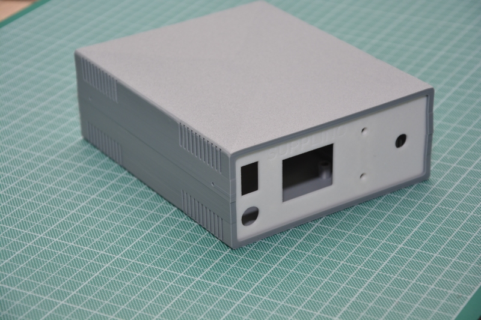
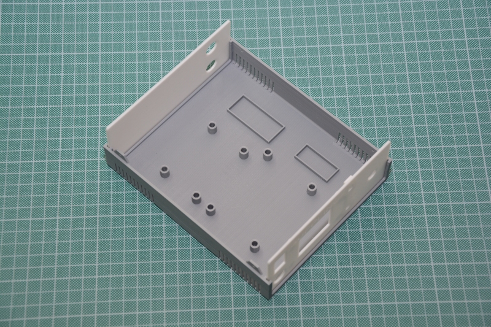
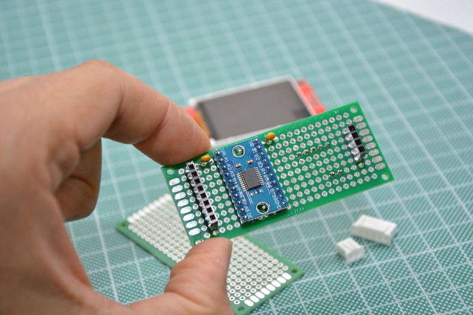
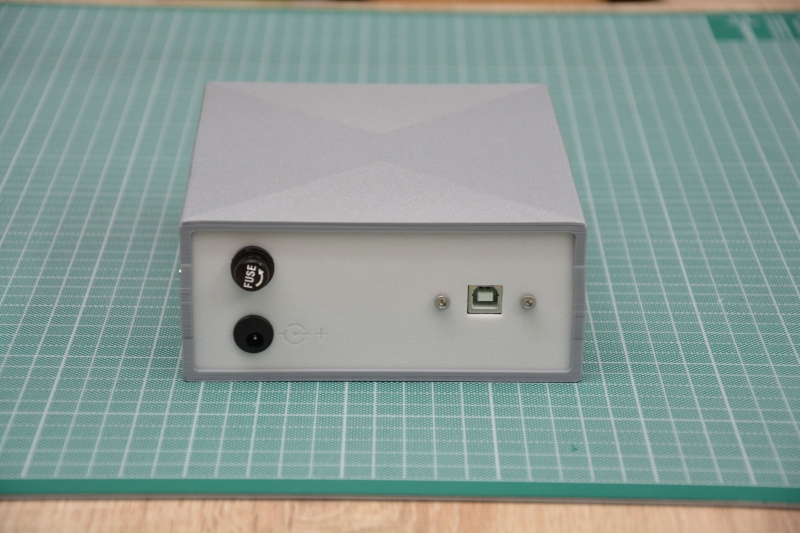
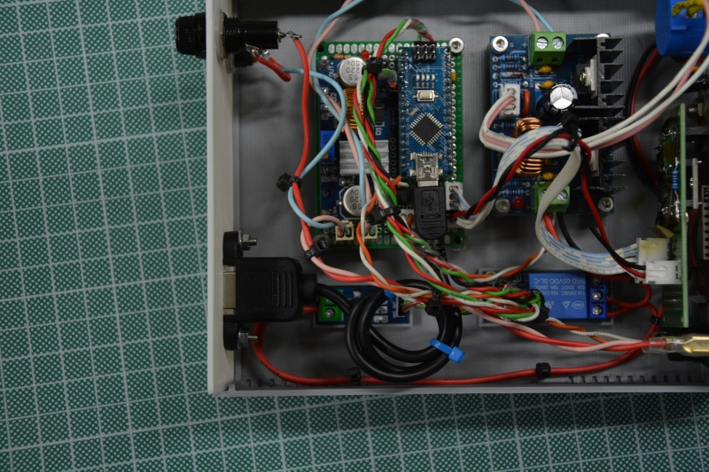

### 3D-printing Enclosure

Two different enclosures are provided.

#### Variant_01 (made by @cyb3rn0id)

- Dimensions: 140x170x60 (Width x Depth x Height)
- Thickness: 2mm

There are 2 sets of 4 feets: one is for the XH-M401 module (switching regulator based on the XL4016E) and another for a 50x70 protoboard. You must insert M3 6mm brass inserts in the feets.

There are 2 slots too: one for the relay module and another for the current sensor ACS712 breakbout board. Arduino Nano and the LM2596S step-down regulator will be mounted on the protoboard. 

Display will be attached on the front panel by screwing 4 short M3 screws without using inserts, directly in the plastic feet. You'll use a 30x70 protoboard on the back of the display for attaching the level shifter and cables

Front panel contains toggle switch, pushbutton, display, output sockets, potentiometer

For the Back panel there are 2 designs: both will contain input socket and fuse holder while the `panel_back_usb.stl` has additional holes for attaching an external USB-Type B panel connector:

This external USB connector will be useful to reprogramming the Arduino without open the enclosure and for eventual future revisions where the USB could be used for reading display and set certain values.

Here is showed how we attached that connector:

We've used [this cable](https://amzn.to/3AdUpwO) but warning: this specific cable is good only if your Arduino Nano has the USB MINI connector (such as some third-party Arduino Nanos) so for sure is not good with the original Arduino Nano Every since uses the USB MICRO.

#### Variant_02 (made by @MrLoba81)
- Dimensions: 160x155x55 (Width x Depth x Height)
- Thickness: 2mm

There are 2 sets of 4 feets: one is for the XH-M401 module (switching regulator based on the XL4016E) and another for a 50x70 protoboard. You must insert M3 6mm brass inserts in the feets.
There are 2 slots too: one for the relay module and another for the  LM2596S step-down regulator. Arduino Nano and current sensor ACS712 breakbout board will be mounted on the protoboard.
Front panel contains pushbutton, display, output sockets, potentiometer
Back panel contains toggle switch, input socket, fuse holder

